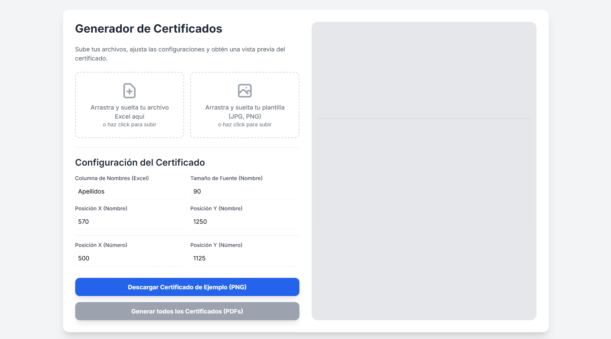

# Certificate Creator

Este proyecto es una aplicación web para la creación y gestión de certificados digitales.

## Vista previa

## Estructura del proyecto

- `index.html`: Página principal de la aplicación web.

## Cómo usar

Puedes acceder a la aplicación directamente desde GitHub Pages:
[https://jhandrychimbo.github.io/Certificate-Creator/](https://jhandrychimbo.github.io/Certificate-Creator/)

O si prefieres ejecutarla localmente:
1. Clona este repositorio.
2. Abre `index.html` en tu navegador web.

## Características

- Generación de certificados personalizados.
- Interfaz sencilla y fácil de usar.
- Procesamiento masivo desde archivos Excel.
- Vista previa en tiempo real.
- Descarga individual o en lote (ZIP con PDFs).

## Instrucciones de uso

### 1. Preparación del archivo Excel
- El archivo Excel debe contener **una sola columna** con los nombres de los participantes.
- Por defecto, la aplicación lee la columna llamada "Apellidos", pero puedes cambiar este nombre en la configuración.
- Asegúrate de que los nombres estén en el formato deseado (ej: "Juan Pérez" o "PÉREZ, Juan").

### 2. Preparación de la imagen de plantilla
- Usa una imagen de **alta calidad** (mínimo 1920x1080 píxeles).
- Formatos soportados: JPG, PNG.
- La imagen debe tener suficiente espacio en blanco donde se colocarán los nombres y números.
- **Recomendación**: Usa imágenes con resolución de 300 DPI para mejor calidad en PDF.

### 3. Configuración de posición y texto
- **Posición X e Y**: Ajusta las coordenadas donde aparecerá el texto en la imagen.
- **Tamaño de fuente**: Experimenta con diferentes tamaños para que el texto se vea proporcional.
- **Vista previa**: Utiliza la vista previa del lado derecho para verificar que todo se vea correctamente.
- **Prueba primero**: Descarga un certificado de ejemplo antes de generar todos.

### 4. Consejos importantes
- Revisa la vista previa antes de generar todos los certificados.
- Si el texto se ve muy pequeño o muy grande, ajusta el tamaño de fuente.
- Si el texto no aparece en la posición correcta, modifica las coordenadas X e Y.
- Para mejores resultados, usa plantillas con fondo claro y texto oscuro.

## Autor

- Jhandry Chimbo

## Licencia

Este proyecto está bajo la licencia MIT.
